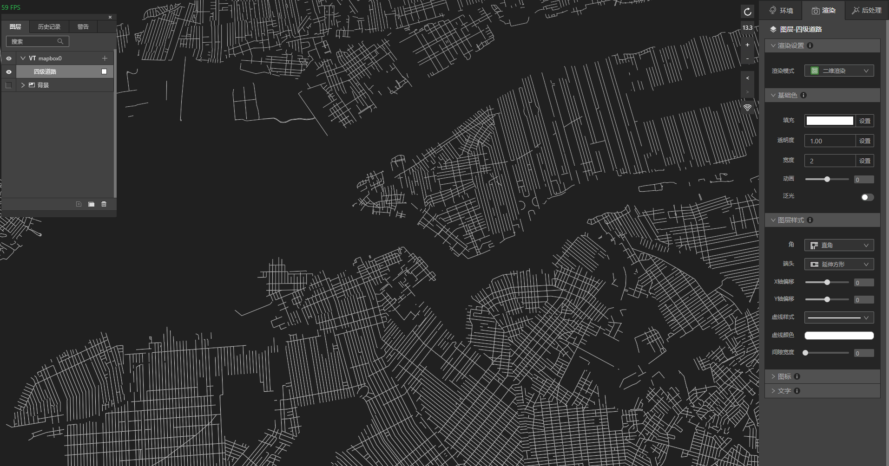

## 实现道路泛光效果

　　本教程中，我们将演示如何让道路实现泛光效果。

### 1、 准备好道路

* 启动IDE，新建一个文件，新建VT图层，VT图层里添加道路数据。

* 地图上即出现了道路数据，接下来在渲染面板中，将基础色“填充”改成白色000000。你也可以改成任意想要的颜色，但是颜色越浅泛光的效果越明显，颜色越深泛光效果越差。

* 文件准备就绪，让我们进入下一步。 

### 2、 泛光设置

* 打开渲染、基础色面板下的泛光按钮。这时候图层面板“四级道路”旁边会出现“光”图标，代表该图层的泛光按钮打开了。

　　现在地图上就可以看到道路泛光的效果了。

* 为了最合适的效果，还可以去后处理面板下的“泛光”面板下调整参数。

　　也可以通过渲染面板下基础色里，调整透明度来增减泛光的效果。

