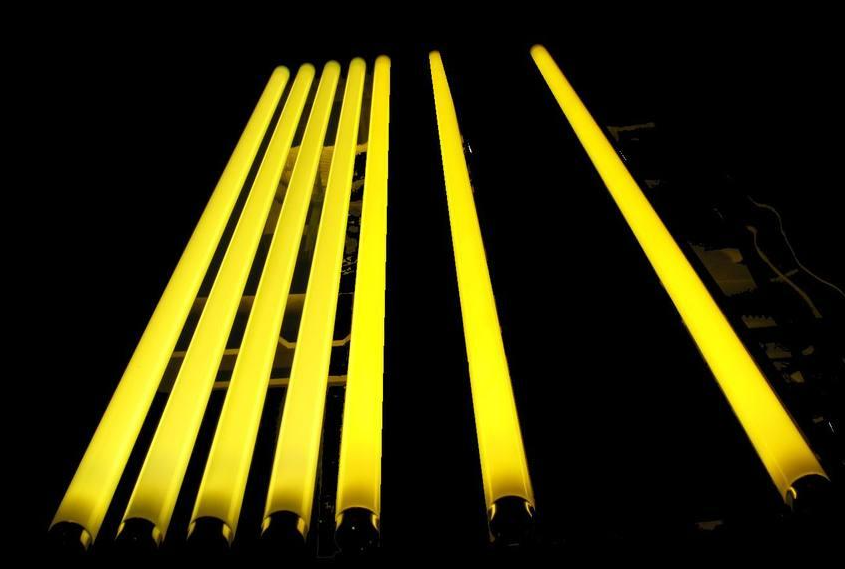
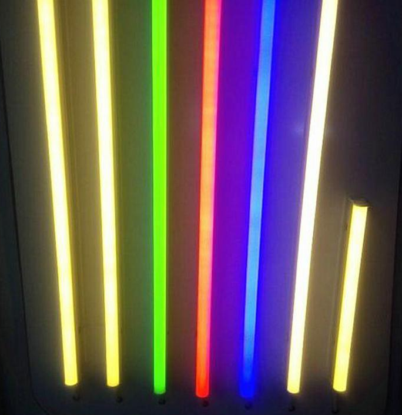
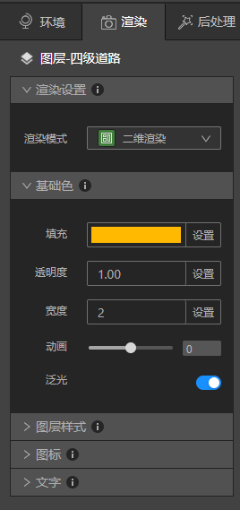
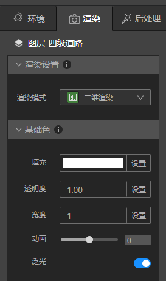

## 实现道路加强版泛光效果

　　如果问黄色灯管灯光是什么颜色？那一定是黄色啦！bingo！你答对了：）

　　那非常明亮的黄色灯管是什么颜色呢？也许你会迟疑一下，确实在现实世界里观察，我们会发现非常明亮的灯光明显在中间部分的颜色比两边要浅，甚至有的接近白色。

　　灯管泛光的样子和地图上道路的样式非常接近，我们能否也让道路实现中间浅两边亮的加强泛光效果呢？当然可以！让我们开始吧：）

### 1、 准备好道路

* 启动Studio，新建一个文件，新建2个VT图层，这2个VT图层里都添加同样的四级道路数据。

### 2、 调整2个图层的渲染参数

* VT1“四级道路”渲染面板下的基础色“填充”改成FFB900，泛光按钮打开。

此时地图上道路发出黄色泛光。

* VT2“四级道路”渲染面板下的基础色“填充”颜色改成000000，宽度改成“1”，泛光按钮打开。

* 将后处理面板“泛光”下的强度因子改成1.7，泛光半径改成0.01。

加强版泛光效果就做好了，是不是很简单呢？：）

