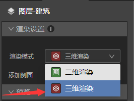
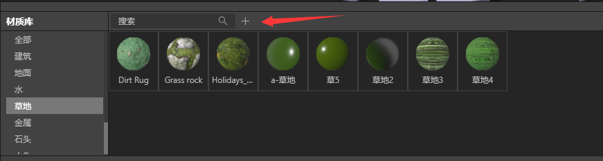
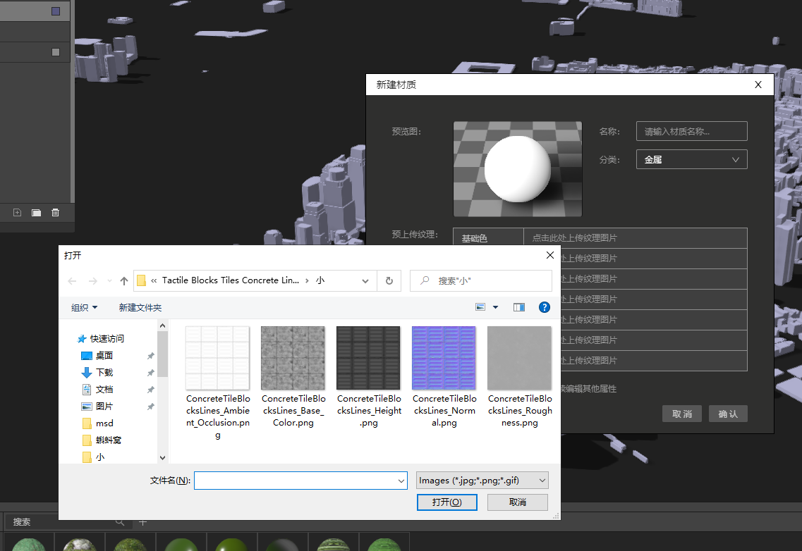
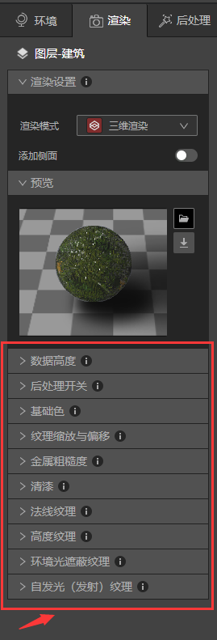

## 导入新的材质球

　　本教程中，我们将演示如何导入新的材质球。

　　现在主流有2种PBR材质工作流：金属/粗糙度工作流（Metal/Roughness）和镜面反射/光泽度工作流（Specular/Glossiness）。

　　Studio支持第一种工作流，即金属/粗糙度工作流（Metal/Roughness）。所以我们可以导入Base Color-基础色纹理、Roughness-粗糙度纹理、Metallic-金属度纹理、Normal-法线纹理、Height-高度纹理、Ambient Occiusion-环境光遮蔽纹理、Emission-自发光纹理，一共6种纹理图片。

### 1、 准备导入材质球

* 启动Studio，，新建一个文件，新建VT图层，VT图层里添加建筑数据。

* 地图上即出现建筑数据，接下来在渲染面板将”渲染模式”下的“二维渲染”切换成“三维渲染”

* 此时地图上建筑图层变成三维模式，同时在最下方会自动弹出材质库。

* 单击材质库工具栏的“新建”按钮+，弹出新建材质面板

* 点击对应的上传框，即可以上传纹理图片。PS：并不是所有的纹理图片都需要上传，根据实际情况调整。

* 上传完毕后，点击确认，新的材质球就可以保存在材质库里了。

### 2、 编辑材质球

* 创建新的材质球后，我们可以在地图上应用，看看是不是想要的效果，如果有不理想的地方，我们可以继续在渲染面板编辑材质球。 

* 调整完毕后，我们可以单击渲染面板的“预览”最右边的保存按钮  ，选择直接保存或者是另存为。

