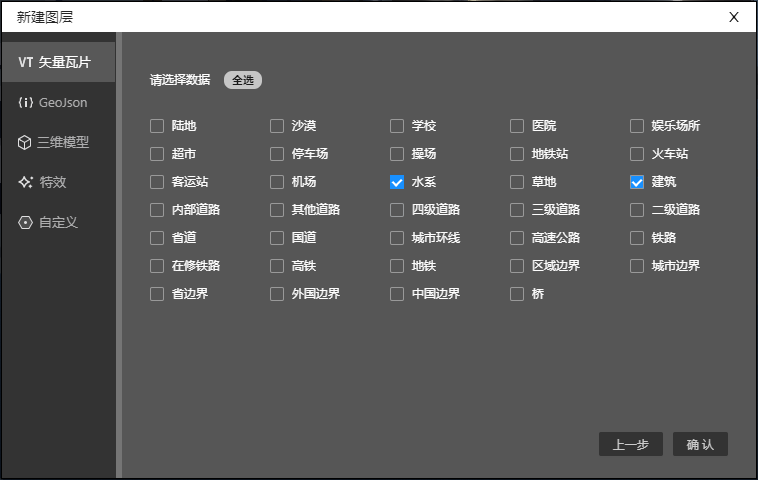
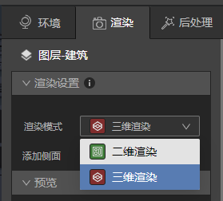

## 给水面增加倒影

本教程中，我们将演示如何简单方便的给建筑物增加屋顶

### 1、准备好建筑物和水面

* 启动Studio，新建一个文件，新建VT图层，VT图层里添加建筑和水系数据。

* 在渲染设置中将建筑和水系数据从二维渲染切换到三维渲染。

* 赋予建筑和水系图层材质球，在地图上应用。

* 文件准备就绪，让我们进入下一步。

### 2、打开水系图层的反射按钮

* 确保后处理面板里“反射”按钮是开启状态，此处默认一直开启。

* 打开水系图层渲染面板，选择后处理开关，将反射按钮打开。

* 此时水系将会出现建筑物的倒影。

* 同时图层面板上水系图层右边会出现“反”图标，代表该图层反射按钮是开启状态。

### 3、 会影响反射效果的几种情况

* 金属度越高、粗糙度越低，反射效果越清晰；金属度越低、粗糙度越高，反射效果越差。

*<small>金属度是1，粗糙度是0的时候，反射非常清晰，效果如下：</small>*

*<small>金属度是0，粗糙度是1的时候，反射已不可见，效果如下：</small>*

* 法线纹理强度越小，反射效果越清晰；法线纹理强度越大，反射效果越模糊

*<small>法线纹理强度是0，反射非常清晰，效果如下：</small>*

*<small>法线纹理强度是5，反射非常模糊，效果如下：</small>*

* 环境光HDR曝光数值越高、反射越浅；曝光数值越高低、反射越深；

*<small>HDR曝光数值是5，反射颜色变浅，效果如下：</small>*

*<small>HDR曝光数值是0，反射已不可见，效果如下：</small>*

## 小结

越光滑的物体表面反射越清晰，越粗糙的物体反射越模糊，所以选择金属类、水、或者其他表面光滑的材质球会非常容易呈现强烈的反射效果，反之如果选择草地、木头等这类粗糙表面的材质球，就算增加金属度，清漆等数值，也不容易呈现清晰的反射效果。

