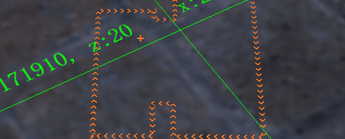

# Symbol样式属性说明

矢量的Symbol样式分为以下几个大类：

* [marker样式属性](#marker样式属性)，定义了图标相关样式属性
* [text样式属性](#text样式属性)，定义了文字相关样式属性
* [line样式属性](#line样式属性)，定义了线相关的样式属性
* [polygon样式属性](#polygon样式属性)，定义了面相关的样式属性。

本文档包含了矢量的样式属性，三维的样式由渲染材质定义，具体请参考[材质说明文档](material)。

## marker样式属性

marker样式属性分为以下几类：

* 基础属性：图标最常用的样式属性
* 矢量图标：[矢量图标](https://maptalks.org/examples/cn/style/vector-marker/#style_vector-marker)可以调整的样式属性
* 对齐：如何让图标与坐标点对齐的属性设置
* 分布：图标是否沿线分布及分布方式的设置
* 碰撞检测：碰撞检测相关设置
* 三维透视：三维透视相关的属性
* 文字自适应：图标高宽自动适应文字的相关样式属性

| 类别 | 属性 |
| -------- | --------- |
| 基础属性   | markerFile, markerOpacity, markerWidth, markerHeight, markerDx, markerDy, markerRotation |
| 对齐       | markerVerticalAlignment, markerHorizontalAlignment, markerRotationAlignment, markerPitchAlignment |
| 分布       | markerPlacement*, markerSpacing, mergeOnProperty |
| 碰撞检测   | markerAllowOverlap, markerIgnorePlacement |
| 三维透视   | markerPerspectiveRatio* |
| 文字自适应 | markerTextFit, markerTextFitPadding |
| 矢量图标   | markerType, markerFill, markerFillPatternFile, markerFillOpacity, markerLineColor, markerLineWidth, markerLineOpacity, markerLineDasharray, markerLinePatternFile  |

:::note
属性名上带*号的，表示该属性不支持[function-type](function-type)。

:::

---------
### markerFile

默认值：null

**String**，图标的地址，支持url或者base64字符串。

---------
### markerOpacity

默认值：1

**Number**，取值范围0-1，图标透明度

---------
### markerWidth

默认值：15

**Number**，取值范围0-254，图标宽度

---------
### markerHeight

默认值：15

**Number**，取值范围0-254，图标高度

---------
### markerDx

默认值：0

**Number**，取值范围0-127，图标在屏幕范围x轴上的偏移量

---------
### markerDy

默认值：0

**Number**，取值范围0-127，图标在屏幕范围y轴上的偏移量

---------
### markerRotation

默认值：0

**Number**，取值范围0-360，图标的旋转角度，单位度

---------
### markerHorizontalAlignment

默认值：middle

**String**，图标相对坐标点的水平对齐方式，取值范围： left, middle, right

---------
### markerVerticalAlignment

默认值：middle

**String**，图标相对坐标点的垂直对齐方式，取值范围： top, middle, bottom

---------
### markerRotationAlignment

默认值：null

**String**，如果设为map，则图标自动随地图旋转而旋转。

---------
### markerPitchAlignment

默认值：null

**String**，如果设为map，则图标自动随地图倾斜而倾斜。

---------
### markerPlacement

默认值：point

不支持function-type

**String**，图标的分布方式，沿线分布还是正常点分布，可选的值：point，line

如果数据是线，且markerPlacement为point时，取的是线的第一个端点的坐标。

如果数据是线，且markerPlacement为line时，沿线每隔markerSpacing取一个坐标。

如果数据是面，且markerPlacement为point时，则取面的可达性极点位置，即使面是凹多边形，该点也一定在面的内部。

---------
### markerSpacing

默认值：250

**Number**，markerPlacement必须是line。即图标沿线分布时，相互的间隔，单位像素。

---------
### mergeOnProperty

默认值：null

**String**，markerPlacement必须是line。是否按照给定property属性合并该属性的值相同的line，能让沿线分布的图标绘制得更加准确，例如：

```json
{
  "mergeOnProperty": "road_name"
}
```

---------
### markerAllowOverlap

默认值：false

**Boolean**，必须开启碰撞检测。当此图标与其他图标碰撞时，是否仍然允许该图标显示。

---------
### markerIgnorePlacement

默认值：false

**Boolean**，必须开启碰撞检测。当此图标与其他图标碰撞时，是否仍然允许其他图标显示。

---------
### markerPerspectiveRatio

默认值：true

不支持function-type

**Boolean**，是否开启三维透视，图标的近大远小效果。

---------
### markerTextFit

默认值：false

**Boolean**，必须设置文字。图标是否根据文字来自动设置自身的高度和宽度。

---------
### markerTextFitPadding

默认值：[0, 0, 0, 0]

**Number[]**，必须设置文字且markerTextFit必须为true。四位数组，单位像素，图标上下左右四边距离文字的padding，四位数字的含义是[上边，右边，下边，左边]

---------
### markerType

默认值：null

**String** 矢量图标类别，可选的值： ellipse, cross, x, diamond, bar, square, triangle, pin, pie, rectangle

---------
### markerFill

默认值：#00f

**String**|**Number[]**，必须有合法的markerType。矢量图标的填充色，可以为[css颜色值](https://developer.mozilla.org/zh-CN/docs/Web/CSS/color_value)或者归一化四位数组。

---------
### markerFillPatternFile

默认值：null

**String**，必须有合法的markerType。矢量图标的模式填充图片地址，支持url或者base64字符串。

---------
### markerFillOpacity

默认值：1

**Number**，必须有合法的markerType。矢量图标填充透明度，取值范围0-1。

---------
### markerLineColor

默认值：#000

**String**|**Number[]**，必须有合法的markerType。矢量图标边框颜色，可以为[css颜色值]((https://developer.mozilla.org/zh-CN/docs/Web/CSS/color_value))或者归一化四位数组。

---------
### markerLineWidth

默认值：1

**Number**，必须有合法的markerType。矢量图标边框线宽。

---------
### markerLineOpacity

默认值：1

**Number**，必须有合法的markerType。矢量图标边框透明度，取值范围0-1。

---------
### markerLineDasharray

默认值：1

**Number[]**，必须有合法的markerType。矢量图标边框虚线样式，与canvas.setLineDash方法支持的虚线样式相同。

---------
### markerLinePatternFile

默认值：null

**String**，必须有合法的markerType。矢量图标边框的模充图片地址，支持url或者base64字符串。

---------

## text样式属性

text样式属性分为以下几类：

* 基础属性：文字最常用的样式属性
* 文字描边：文字描边的相关属性
* 对齐：如何让文字与坐标点对齐的设置
* 碰撞检测：碰撞检测相关设置
* 三维透视：三维透视相关的属性

| 类别 | 属性 |
| -------- | --------- |
| 基础属性   | textName, textSize, textFill, textOpacity, textFaceName, textWeight, textStyle, textRotation, textDx, textDy, textWrapWidth  |
| 文字描边   | textHaloFill, textHaloRadius, textHaloOpacity, textHaloBlur  |
| 对齐       | textHorizontalAlignment, textVerticalAlignment, textRotationAlignment, textPitchAlignment |
| 分布       | textPlacement*, textSpacing, mergeOnProperty |
| 碰撞检测   | textAllowOverlap, textIgnorePlacement |
| 三维透视   | textPerspectiveRatio* |

:::note
属性名上带*号的，表示该属性不支持[function-type](function-type)。

:::

---------
### textName

默认值：null

**String**，显示的文字内容，如果要显示某个属性得值，用大括号括起来即可，例如：

```json
{
  // 用name属性的值作为文字内容
  "textName": "{name}"
}
```

---------
### textSize

默认值：14

**Number**，文字大小。

---------
### textFill

默认值：[0, 0, 0, 0]

**String** | **Number**，文字颜色，可以是[css颜色值](https://developer.mozilla.org/zh-CN/docs/Web/CSS/color_value)或者四位归一化数组。

---------
### textOpacity

默认值：1

**Number**，文字透明度，取值范围0-1。

---------
### textFaceName

默认值：monospace

**String**，文字字体，与css的[font-family](https://developer.mozilla.org/zh-CN/docs/Web/CSS/font-family)定义相同。

---------
### textWeight

默认值：400

**String**，文字字重，与css的[font-weight](https://developer.mozilla.org/zh-CN/docs/Web/CSS/font-weight)定义相同。

---------
### textStyle

默认值：normal

**String**，文字风格，支持斜体等，与css[font-style](https://developer.mozilla.org/zh-CN/docs/Web/CSS/font-style)定义相同。

---------
### textRotation

默认值：0

**Number**，文字旋转角度，0-360，单位度。

---------
### textDx

默认值：0

**Number**，文字在屏幕x轴上的偏移度，单位像素。

---------
### textDy

默认值：0

**Number**，文字在屏幕y轴上的偏移度，单位像素。

---------
### textWrapWidth

默认值：240

**Number** 文字换行长度，即文字长度超过该值时就会自动换行。

---------
### textHaloFill

默认值：[1, 1, 1, 1]

**String** | **Number[]**，文字描边颜色，可以是[css颜色值](https://developer.mozilla.org/zh-CN/docs/Web/CSS/color_value)或者四位归一化数组。

---------
### textHaloRadius

默认值：0

**Number**，文字描边半径。

---------
### textHaloOpacity

默认值：1

**Number**，文字描边透明度，取值范围0-1。

---------
### textHaloBlur

默认值：0

**Number**， 文字描边的清晰度。

---------
### textHorizontalAlignment

默认值：middle

**String**，文字相对坐标点的水平对齐方式，取值范围： left, middle, right

---------
### textVerticalAlignment

默认值：middle

**String**，文字相对坐标点的垂直对齐方式，取值范围： top, middle, bottom

---------
### textRotationAlignment

默认值：null

**String**，如果设为map，则文字自动随地图旋转而旋转。

---------
### textPitchAlignment

默认值：null

**String**，如果设为map，则文字自动随地图倾斜而倾斜。

---------
### textPlacement

默认值：point

不支持function-type

**String**，文字的分布方式，沿线分布还是正常点分布，可选的值：point，line，如果是icon渲染插件，且设置过markerPlacement，则被markerPlacement的值替代。

如果数据是线，且textPlacement为point时，取的是线的第一个端点的坐标。

如果数据是线，且textPlacement为line时，沿线每隔textSpacing取一个坐标。

如果数据是面，且textPlacement为point时，则取面的可达性极点位置，即使面是凹多边形，该点也一定在面的内部。

---------
### textSpacing

默认值：250

**Number**，textPlacement必须是line。即文字沿线分布时，相互的间隔，单位像素，如果是icon渲染插件，且设置过markerSpacing，则被markerSpacing的值替代。

---------
### mergeOnProperty

默认值：null

**String**，textPlacement必须是line。是否按照给定property属性合并该属性的值相同的line，能让沿线分布的文字绘制得更加准确，例如：

```json
{
  "mergeOnProperty": "road_name"
}
```

---------
### textAllowOverlap

默认值：false

**Boolean**，必须开启碰撞检测。当此文字与其他文字碰撞时，是否仍然允许该文字显示。

---------
### textIgnorePlacement

默认值：false

**Boolean**，必须开启碰撞检测。当此文字与其他文字碰撞时，是否仍然允许其他文字显示。

---------
### textPerspectiveRatio

默认值：true

不支持function-type

**Boolean**，是否开启三维透视，文字的近大远小效果。

---------

## line样式属性

---------
### lineColor

默认值: #000

**String** | **Number[]** 线的颜色，可以为[css颜色值](https://developer.mozilla.org/zh-CN/docs/Web/CSS/color_value)或者归一化四位数组。

---------
### lineWidth

默认值：2

**Number** 线宽，取值范围 0 - 127。

---------
### lineOpacity

默认值：1

**Number** 线的透明度，取值范围 0 - 1。

---------
### lineJoin

默认值：miter

**String**，线的连接样式，可选的值：miter，round，bevel。

---------
### lineCap

默认值：butt

**String**，线头的样式，可选的值：butt，round，square

---------
### lineDx

默认值：0

**Number**，线在屏幕坐标x轴上的偏移量，单位像素，取值范围：-128 - 127

---------
### lineDy

默认值：0

**Number**，线在屏幕坐标y轴上的偏移量，单位像素，取值范围：-128 - 127

---------
### lineStrokeWidth

默认值：0

**Number**，线的描边宽度，取值范围 0 - 127。

---------
### linePatternFile

默认值：null

**String**，线的填充图片，支持url或者base64字符串。

---------
### linePatternGap

默认值：0

**Number**，填充图片之间的间隔宽度，单位为填充图片宽度的倍数，例如设为1时，相邻两张填充图片之间的间隔为填充图片的宽度。

---------
### linePatternAnimSpeed

默认值：0

**Number**，动画速度，取值范围-5到5，为负数时，动画方向会变为反向的。



---------
### lineDasharray

默认值：[0, 0, 0, 0]

**Number[]** 线的虚线样式，四位数组，单位像素，含义类似canvas的setLineDash，但只支持四位。

---------
### lineDashColor

默认值: [0, 0, 0, 0]

**String** | **Number[]**，线虚线的颜色，可以为[css颜色值](https://developer.mozilla.org/zh-CN/docs/Web/CSS/color_value)或者归一化四位数组。

## polygon样式属性

---------
### polygonFill

默认值: #fff

**String** | **Number[]** 面的填充色，可以为[css颜色值](https://developer.mozilla.org/zh-CN/docs/Web/CSS/color_value)或者归一化四位数组。

---------
### polygonOpacity

默认值：1

**Number** 面的填充色透明度，取值范围 0 - 1。

---------
### polygonPatternFile

默认值：null

**String**，面的填充图片，支持url或者base64字符串。

---------
### uvScale

默认值：[1, 1]

**Number[]**，纹理的缩放倍数，两位数组。

---------
### uvOffset

默认值：[0, 1]

**Number[]**，两位数组，纹理的偏移量，0表示不偏移，1表示偏移量等于图片的尺寸，例如0.5表示偏移到图片的一半。